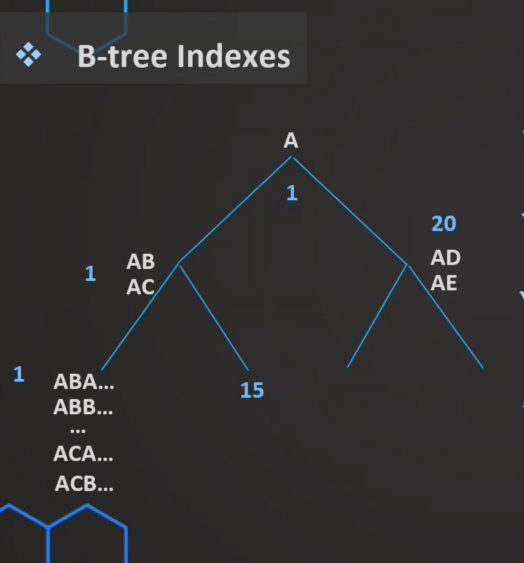
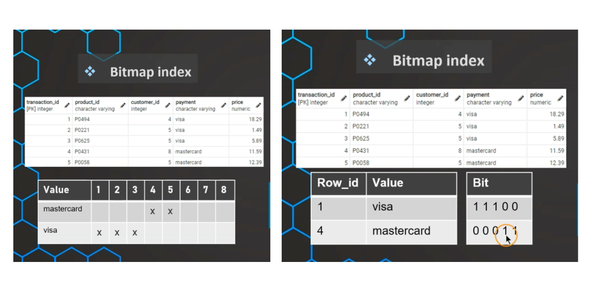

### Manager user
- 
- 
- 
- 
- 
- 
- [readme](images/role1.sql)
- [challenge](images/role2.sql)
### Indexes
- Indexes help to make data reads faster!
- (:) Slower data writes
- (:) Additional storage
- B-tree indexes :
    - Multi-level tree structure
    - Breaks data down into pages or blocks
    - Should be used for high-cardinality (unique) columns
    - Not entire table (costy in terms of storage)
- Bitmap indexes :
    - Particularily good for dataware
    - Large amounts of data + low-cardinality
    - Very storage efficient
    - Good for many repeating values (dimensionality)

| B-tree Index | Bitmap index |
|---|---|
| Default index|Slow to update|
| Unique columns (surrogate key, names)|Storage efficient|
||Great read performance|
- Notes:
    - Small tables do not require indexes
    - The better using with large tables and column that are used as filters
- Create index :
- Code demo:
```
SELECT
(SELECT AVG (amount)
FROM payment p2
WHERE p2.rental_id=p1.rental_id)
FROM payment p1

CREATE INDEX index_rental_id_payment
ON payment(rental_id)

DROP INDEX index_rental_id_payment
```