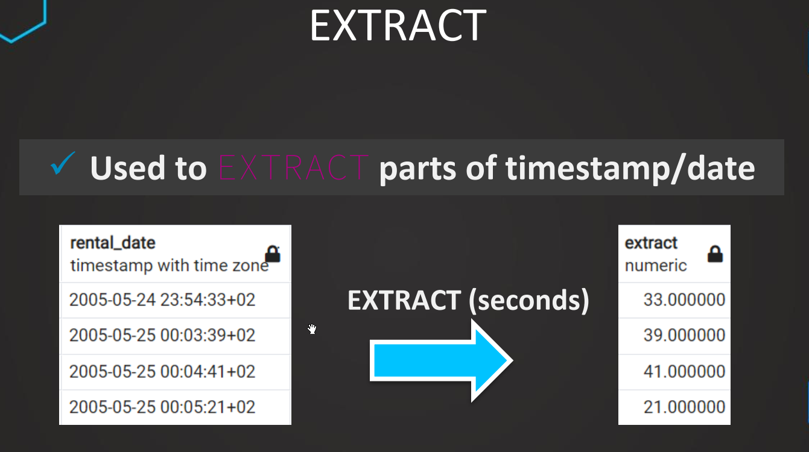
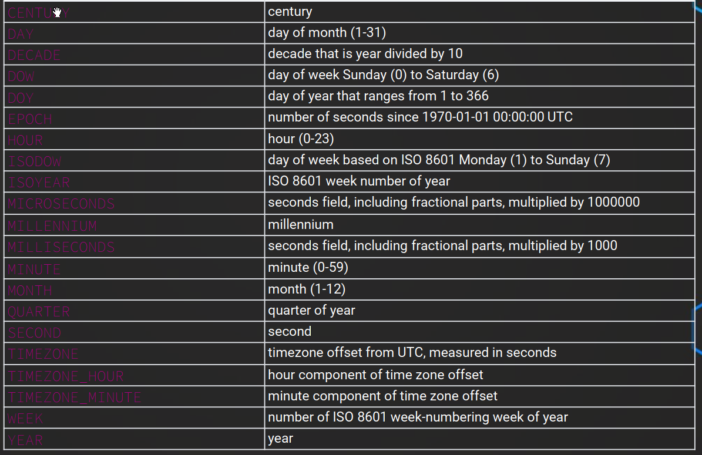
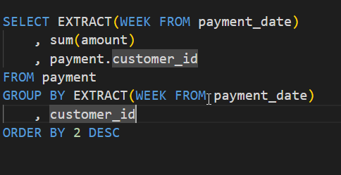
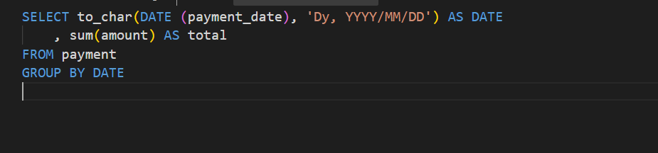
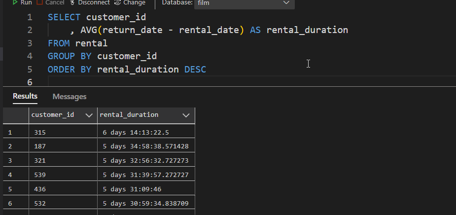

### String
- Length, lowner, upper:
	`LENGTH(email)`
- Left & Right:
	`LEFT(email,1)`
- Substring:
	`SELECT SUBSTRING('SQL Tutorial', start, length) AS ExtractString;`
- Concatenate:
	`SELECT 'Hello' || 'World' FROM CUSTOMER`
- Position: 
	`POSITION('@' IN email)`
- Extract:
	
	
	
	
- To char:
	
	
- Timestamps:
	
	