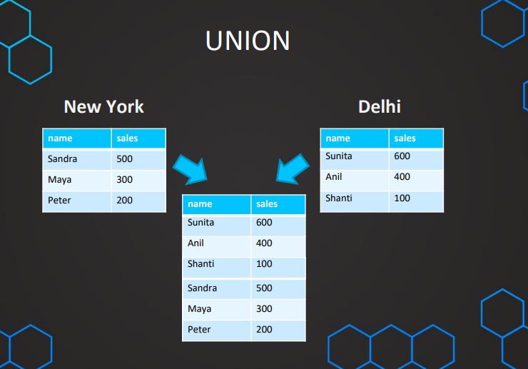
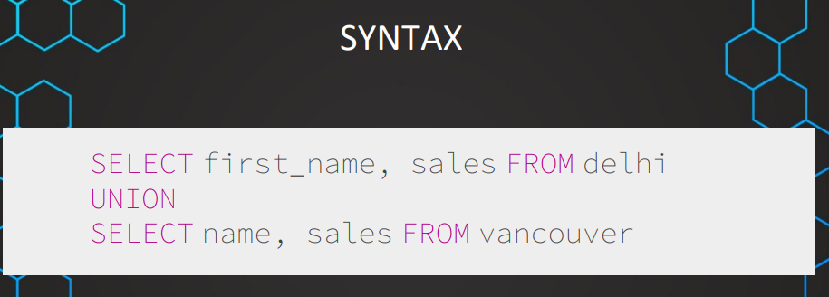
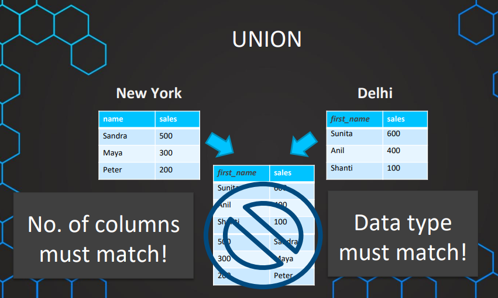
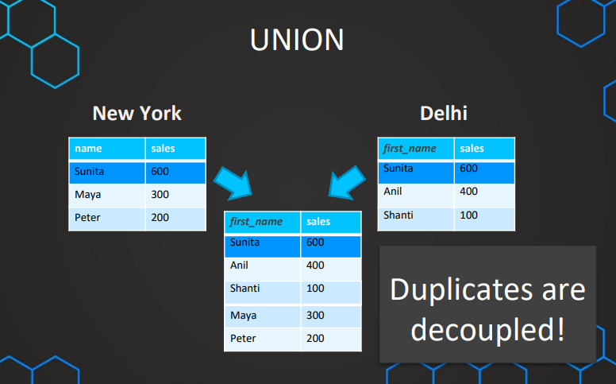
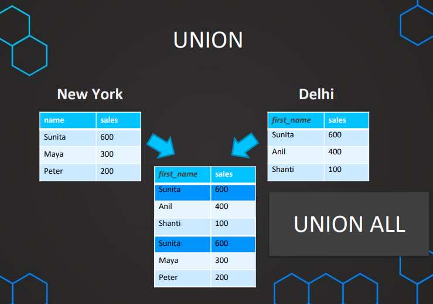
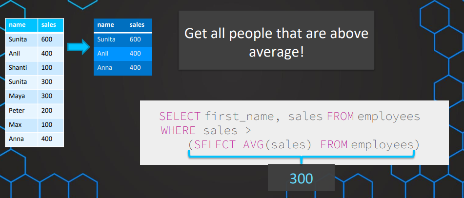
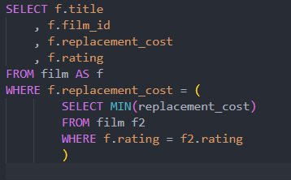
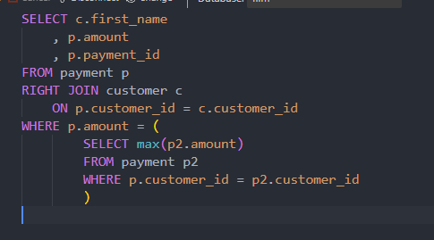

### Advanced UNION & Subqueries
- UNION
	- Notes: 
		- The order matches the column!
		- Data type must match
		- Duplicates are decoupled! (avoid it using union all)
	- 
	- 
	- 
	- 
	- 
### Correlated subqueries
- 
- 
- 